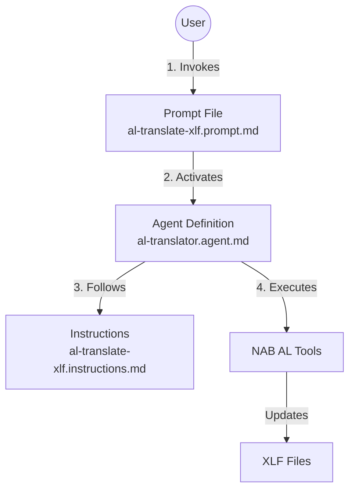

# Optimized NAB AL Tools Translation Workflow

This repository contains an optimized set of AI agent configuration files for automating Business Central translations using [NAB AL Tools](https://github.com/jwikman/nab-al-tools) by NAB Solutions AB.

These files are refined versions of the original NAB AL Tools prompts and agents, optimized for better consistency, "DRY" (Don't Repeat Yourself) principles, and improved glossary handling.

## Files Overview

### Core Workflow
*   **`al-translate-xlf.instructions.md` (The Brain)**:
    *   Contains the core rules, invariants, and step-by-step logic for the translation workflow.
    *   Enforces the "Swedish First" policy for Nordic languages.
    *   Handles glossary logic via getGlossaryTerms (merging local and built-in glossaries automatically).

*   **`al-translator.agent.md` (The Body)**:
    *   Defines the AI Agent, its available tools, and the high-level execution loop.
    *   Orchestrates the build -> sync -> translate -> review cycle.

*   **`al-translate-xlf.prompt.md` (The Trigger)**:
    *   The main entry point to start the translation task.
    *   References the Agent and Instructions to avoid logic duplication.

### Auxiliary Prompts
*   **`al-update-glossary.prompt.md`**:
    *   Scans the app's source texts to identify common terms missing from the glossary.
    *   Suggests new entries for glossary.tsv.

*   **`al-review-translations.prompt.md`**:
    *   Performs a quality check on existing translations.
    *   Verifies glossary usage and placeholder integrity.
    *   Fixes or approves translations marked as "needs-review".

## Workflow Architecture

The system is designed as a three-layer architecture where each file plays a specific role.

### Relationship Diagram

1.  **The Prompt (Trigger)**: The user invokes a specific task (e.g., `/al-translate-xlf`). This file acts as the entry point and automatically selects the correct Agent.
2.  **The Agent (Executor)**: The prompt activates the `al-translator` agent. This agent has access to the specific tools needed (Build, Refresh, Translate) and defines the high-level loop.
3.  **The Instructions (Rules)**: The agent reads the detailed instructions to understand *how* to perform the task (e.g., "Swedish First" policy, Glossary rules).

## Usage

### 1. Prerequisites
*   VS Code with [NAB AL Tools](https://marketplace.visualstudio.com/items?itemName=nabsolutions.nab-al-tools) extension installed.
*   An active Business Central project with an `app.json` and Translations folder.
*   (Optional) A glossary.tsv file in the Translations folder for project-specific terms.

### 2. Step-by-Step Example

Follow this flow to translate an app:

1.  **Open Copilot Chat**: Click the Chat icon in the VS Code sidebar.
2.  **Select Agent (Optional)**: While the prompt automatically selects the agent, you can explicitly type `@al-translator` to ensure you are in the right context.
3.  **Invoke Prompt**: Type `/al-translate-xlf` and press Enter.
    *   *Note: You do not need to copy-paste the file content.*
4.  **Execution**:
    *   Copilot will read the **Prompt**.
    *   It will switch to the **Agent** configuration.
    *   It will read the **Instructions** to learn the rules.
    *   It will start the workflow: Build -> Refresh -> Translate -> Save.
5.  **Monitor**: Watch the progress as the agent processes batches of translations.

**Other Commands:**
*   **Update Glossary**: Type `/al-update-glossary` to find missing terms.
*   **Review Translations**: Type `/al-review-translations` to check quality.

## Optimizations Applied

*   **Automated Glossary Merging**: Removed manual file parsing; relies on getGlossaryTerms to merge local glossary.tsv with standard terms.
*   **Unified Tool Naming**: Standardized tool calls to match the extension's namespace.
*   **Mandatory Build Step**: Enforces al_build before translation to ensure g.xlf is current.
*   **Simplified Prompting**: Decoupled the trigger prompt from the workflow logic to prevent drift.

## Business Central AL Translation Glossary Handling

**Do I Need to Update the Glossary?**

In most cases, you do **NOT** need to manually update or maintain a glossary file.

**When Should I Use a Custom Glossary or the Update Prompt?**

- Only if you have project-specific or company-specific terms that are not covered by the standard BC glossary (for example, PrintVis-specific terminology).
- In that case, maintain a custom `glossary.tsv` file and use the `al-update-glossary.prompt.md` prompt to help identify and add missing terms.

| Scenario                                 | Action Needed?                |
|-------------------------------------------|-------------------------------|
| Standard BC terminology only              | No custom glossary needed     |
| Project-specific or custom terms required | Use/maintain custom glossary  |

> **If you are only using standard BC terms, you can skip the glossary update prompt and custom glossary file.**

---
*Disclaimer: These files are derived from and optimized for the NAB AL Tools extension by NAB Solutions AB. They are intended to enhance the AI-assisted translation experience within that ecosystem.*
